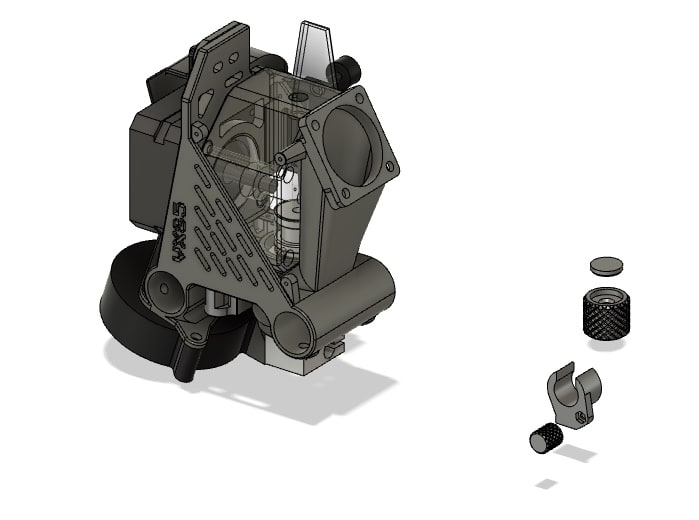
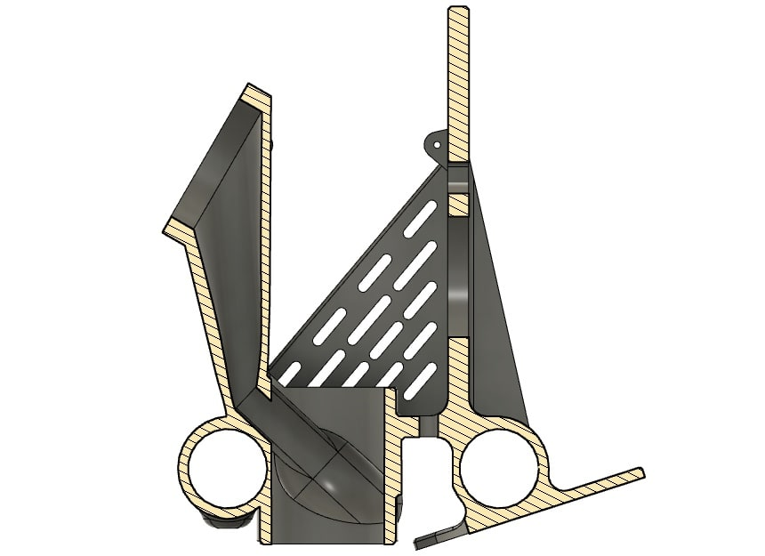
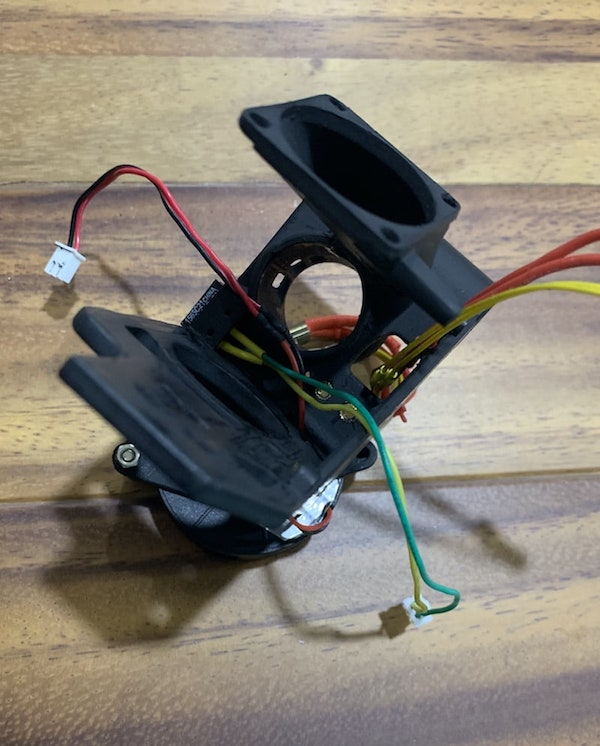
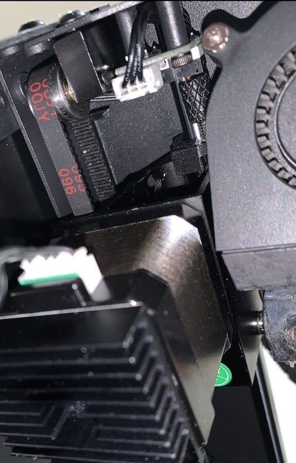

# FlyingBear Ghost 5: Direct Extruder
|  |The project requires minimal operating skills with electronics, you must have a simple multimeter and soldering iron as well as to be able to use them properly. Everything you do hereinafter is at your own risk. :) |
|:---:|:---|
|  | **Please refer to [issues](https://github.com/way5/flyingbear-G5-full-direct-extruder/issues) :beetle: if you have any suggestion or found an error.** |

## **+ Description**

**BOM:**

1. Carrige:
   -  BMG feeder by Mellow Store (right) - 1 pcs.
   -  NEMA17HS4023 motor - 1 pcs.
   -  Bolt M3 - 5 pcs.
   -  Nut M3 - 4 pcs.
   -  Screw M2 (PCB) - 3 pcs.
   -  Thru Threaded Inserts M3 - 5 pcs.
   -  Threaded Stud Bolt M3 - 4 pcs.
2. Y-axis Limit Switch:
   -  Bolt + Nut + Washer M2 - 1 pcs.
   -  Any suitable Coil Spring (see photos) - 1 pcs.
3. PCB:
   -  SMD LED diode - 1 pcs.
   -  SMD Resistor ≥ 1kOhm - 1 pcs.
   -  SMD Capacitor ~ 10nF - 1 pcs.
   -  Header Male 2x1 pins - 6 pcs.
   -  Header Male 7x2 pins - 1 pcs.

I'd recommend PETG or ABS plastic for all the printed parts. Keep in mind that it will be exposed to high heat near the hotend, espetially if you are using heated chamber on your printer.

The list of the parts you'd neet to print:

- Carrige
- Carrige Belt Clip
- Nozzle
- Y-axis Shaft Base + Pin Head
- Z-axis Nut + Nut Cap
- Back side cap for extruder motor insert

In case if you have installed heated chamber I strongly recommend you to prevent extruder motor overheat by using heatsinks and a cooling fan. I am using 30x30mm turbine that is attached to the carrige through the [extruder motor shroud](./OBJ/EXTRUDER%20MOTOR%20SHROUD.obj). See the corresponding 3d model.

Your new hotend carrige would look like this:

||||
| --- | --- | --- |

For the extruder heatsink cooling being used stock Flyingbear's 30x30mm fan that is electrically connected (in parallel) to the same female pin header with extruder motor fan. Hotend cooling fan sits on the top of the air duct sleeve and blows downwards to the heatsink, see image below.

You also would need to replace the standard PCB with following. You can make it yourself using etching method or using CNC if you have one. However I'd not recommend you to order a PCBs for now, because yet there are things to adjust or maybe to change.

|||
|:---:|:---:|

You might like to use a cable chain with your new extruder, so here it is. See [cable chain 1](OBJ/CABLE%20CHAIN%20LINK.obj), [cable chain 2](OBJ/CABLE%20CHAIN%20TERMLK.obj) and [cable chain 3](OBJ/CABLE%20CHAIN%20LOCK.obj).

In addition you need to do a few more mods since home limit switches now are not reachable for the carriges. Linear bearings on the heated bed should be turned upside down, Z-axis limit switch assembly moves 10mm up (see product assembly) and an extension pin added on Y-axis carrige (see product assembly).
Also remove the X-axis limit switch bolt, you'll no longer need it.

At last you need to make changes in your printer firmware config. Change the maximum coordinate parameters as follows:

<code><pre>
>X_MIN_POS 0
>Y_MIN_POS 0
>Z_MIN_POS 0
>X_MAX_POS 254
>Y_MAX_POS 195
>Z_MAX_POS 210
</pre></code>

You can still adjust maximum values +/- few millimeters.

## **+ Final product view and assembled weights**

||||||||||
| --- | --- | --- | --- | --- | --- | --- | --- | --- |
||||||||||||

